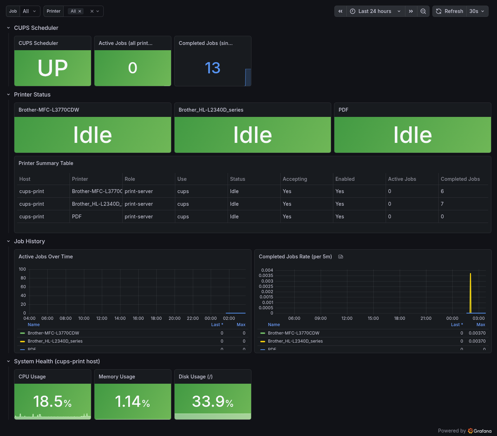

# cups-prometheus-exporter

A lightweight Prometheus exporter for CUPS print server metrics. Built out of necessity
when I realized there was no simple way to monitor my homelab print server in Grafana —
so I wrote one.

Exposes printer status, job queue depth, and scheduler health via a `/metrics` HTTP
endpoint on port `9628`. Runs as a Docker container alongside your CUPS server using the
CUPS Unix socket directly, so no network config or credentials needed.



---

## Metrics

| Metric | Type | Description |
|---|---|---|
| `cups_up` | gauge | CUPS scheduler is reachable (0/1) |
| `cups_printer_status` | gauge | Printer state: 0=idle, 1=printing, 2=stopped/error |
| `cups_printer_accepting` | gauge | Printer is accepting jobs (0/1) |
| `cups_printer_enabled` | gauge | Printer is enabled (0/1) |
| `cups_jobs_active` | gauge | Active/pending jobs per printer |
| `cups_jobs_completed` | counter | Completed jobs per printer since CUPS start |

All per-printer metrics include a `printer` label with the printer name, e.g.
`cups_printer_status{printer="Brother-MFC-L3770CDW"}`.

---

## Requirements

- Docker + Docker Compose
- CUPS running on the same host with the Unix socket at `/var/run/cups/cups.sock`
- Prometheus (to scrape the metrics)

---

## Files

```
cups-prometheus-exporter/
├── cups_exporter.py       # The exporter itself
├── Dockerfile             # Builds the container image
├── docker-compose.yml     # Deploy with Docker Compose
└── README.md
```

---

## Quickstart

### 1. Clone the repo

```bash
git clone https://your-gitea-or-github/cups-prometheus-exporter.git
cd cups-prometheus-exporter
```

### 2. Build the image

```bash
docker compose build cups-exporter
```

### 3. Start the exporter

```bash
docker compose up -d cups-exporter
```

### 4. Verify it's working

```bash
curl http://localhost:9628/metrics
```

You should see Prometheus-formatted output like:

```
# HELP cups_up Whether the CUPS scheduler is running
# TYPE cups_up gauge
cups_up 1
# HELP cups_printer_status Printer state: 0=idle, 1=printing, 2=stopped
# TYPE cups_printer_status gauge
cups_printer_status{printer="Brother-MFC-L3770CDW"} 0
```

---

## Docker Compose

Only the `cups-exporter` service is required. The full `docker-compose.yml` in this repo
also includes `node-exporter` and `cadvisor` for host and container metrics — include or
drop those based on your setup.

```yaml
cups-exporter:
  build:
    context: .
    dockerfile: Dockerfile
  image: cups-exporter:local
  container_name: cups-exporter
  restart: unless-stopped
  environment:
    - CUPS_SERVER=/var/run/cups/cups.sock
  volumes:
    - /var/run/cups/cups.sock:/var/run/cups/cups.sock:ro
  network_mode: host
  healthcheck:
    test: ["CMD", "curl", "-f", "http://localhost:9628/metrics"]
    interval: 30s
    timeout: 5s
    retries: 3
    start_period: 10s
```

> **Note:** `network_mode: host` is required so the container can reach the CUPS socket
> and expose metrics on the host network. The `ports:` directive has no effect in host
> network mode and can be omitted — Docker will warn you about this, which is expected.

---

## Dockerfile

```dockerfile
FROM python:3.12-slim

RUN apt-get update -qq && \
    apt-get install -y -qq --no-install-recommends \
    cups-client \
    curl && \
    rm -rf /var/lib/apt/lists/*

COPY cups_exporter.py /app/cups_exporter.py

EXPOSE 9628
CMD ["python3", "/app/cups_exporter.py", "--port", "9628"]
```

`curl` is included for the Docker healthcheck. `cups-client` provides `lpstat` which
is how the exporter talks to CUPS.

---

## Prometheus Configuration

Add this job to your `prometheus.yml` scrape config:

```yaml
scrape_configs:
  - job_name: 'cups-exporter'
    scrape_interval: 30s
    metrics_path: /metrics
    static_configs:
      - targets: ['192.168.70.10:9628']
        labels:
          role: 'print-server'
          use: 'cups'
          hostname: 'cups-print'
```

Replace `192.168.70.10` with the IP of your CUPS host. If Prometheus is on the same
machine, use `localhost:9628`.

---

## Completed Job History

By default CUPS may not keep completed job history. To enable it add this to
`/etc/cups/cupsd.conf`:

```
MaxJobs 500
PreserveJobHistory Yes
PreserveJobFiles No
```

Then restart CUPS:

```bash
sudo systemctl restart cups
```

Without this, `cups_jobs_completed` will always return 0.

---

## Changing the Port

Default port is `9628`. Override in `docker-compose.yml` if needed:

```yaml
command: ["python3", "/app/cups_exporter.py", "--port", "9999"]
```

---

## Rebuilding After Changes

If you edit `cups_exporter.py` or the `Dockerfile`:

```bash
docker rm -f cups-exporter
docker compose build cups-exporter
docker compose up -d cups-exporter
```
