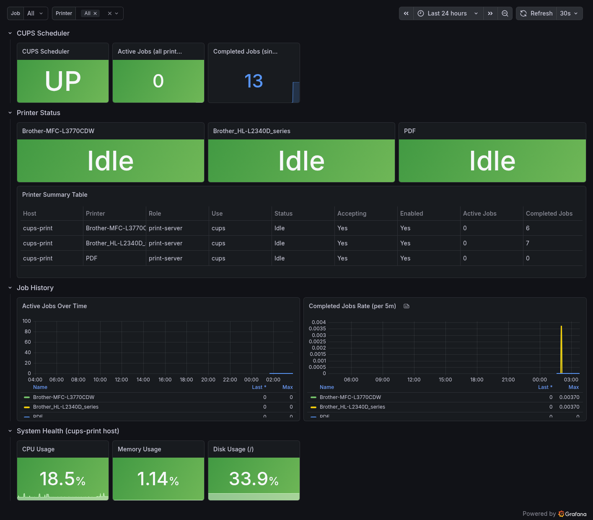

# cups-prometheus-exporter

A lightweight Prometheus exporter for CUPS print server metrics. It exposes printer
status, queue depth, completed-job history, and scheduler health on `/metrics` at port
`9628`.



## Metrics

| Metric | Type | Description |
|---|---|---|
| `cups_up` | gauge | CUPS scheduler is reachable (0/1) |
| `cups_printer_status` | gauge | Printer state: 0=idle, 1=printing, 2=stopped/error |
| `cups_printer_accepting` | gauge | Printer is accepting jobs (0/1) |
| `cups_printer_enabled` | gauge | Printer is enabled (0/1) |
| `cups_jobs_active` | gauge | Active/pending jobs per printer |
| `cups_jobs_completed` | gauge | Completed jobs currently retained by CUPS per printer |

All per-printer metrics include a `printer` label. Completed jobs are a gauge because
CUPS can remove old history when retention limits are reached.

## Requirements

- Docker and Docker Compose
- CUPS running on the same host with `/var/run/cups/cups.sock`
- Prometheus configured to scrape the exporter

## Quickstart

```bash
git clone https://github.com/variablenix/cups-prometheus-exporter.git
cd cups-prometheus-exporter
docker compose up -d
curl http://localhost:9628/metrics
```

The default Compose file pulls `ghcr.io/variablenix/cups-prometheus-exporter:latest`,
mounts the CUPS Unix socket read-only, and publishes the exporter on port `9628`.
It does not use host networking; the Unix socket mount is sufficient for CUPS access.

If the host's CUPS socket uses a group ID other than `7`, set it before starting:

```bash
CUPS_SOCKET_GID=1001 docker compose up -d
```

You can also change the published port or image without editing the Compose file:

```bash
CUPS_EXPORTER_PORT=9962 docker compose up -d
CUPS_EXPORTER_IMAGE=cups-exporter:local docker compose up -d
```

The container has separate endpoints for orchestration:

- `/healthz` is a liveness check and returns `200` while the exporter is running.
- `/readyz` returns `200` only when the CUPS scheduler is reachable.
- `/metrics` returns Prometheus text exposition data.

## Building locally

```bash
docker build -t cups-exporter:local .
CUPS_EXPORTER_IMAGE=cups-exporter:local docker compose up -d
```

The image runs as an unprivileged user. On Linux, `CUPS_SOCKET_GID` must match the
group owning the mounted CUPS socket so the exporter can read it.

## Publishing to GHCR

The image is published to
`ghcr.io/variablenix/cups-prometheus-exporter`. The helper uses Docker Buildx and
publishes build provenance and an SBOM:

```bash
export GITHUB_TOKEN=TOKEN_WITH_WRITE_PACKAGES
./build-and-publish.sh
./build-and-publish.sh 1.0.0
```

The manual helper accepts either `1.0.0` or `v1.0.0` and publishes the Docker tag as
`1.0.0`.

For a multi-platform image, set `DOCKER_PLATFORM` before running the helper, for
example `DOCKER_PLATFORM=linux/amd64,linux/arm64`.

GitHub Actions publishes automatically after CI passes:

- pushes to `main` publish `latest` and an immutable `sha-*` tag;
- tags such as `v1.2.3` publish `1.2.3`, `1.2`, and an immutable `sha-*` tag.

The image is pushed; an existing Dockhand stack still needs to pull/redeploy the
stack to replace its running container. The included Watchtower label intentionally
keeps Watchtower from performing that update automatically.

## Prometheus configuration

```yaml
scrape_configs:
  - job_name: cups-exporter
    scrape_interval: 30s
    metrics_path: /metrics
    static_configs:
      - targets: ["192.168.70.10:9628"]
        labels:
          role: print-server
```

Replace the target with the address of the host running the exporter.

## Completed job history

CUPS must retain completed jobs for `cups_jobs_completed` to be useful. Add the
following to `/etc/cups/cupsd.conf` and restart CUPS:

```text
MaxJobs 500
PreserveJobHistory Yes
PreserveJobFiles No
```

## Development and CI

The GitHub Actions workflow checks Python syntax and tests, shell-script quality,
Compose configuration, Dockerfile quality, image buildability, and high/critical
container vulnerabilities. Run the local checks with:

```bash
python3 -m unittest discover -s tests -v
shellcheck build-and-publish.sh
docker compose config
```
